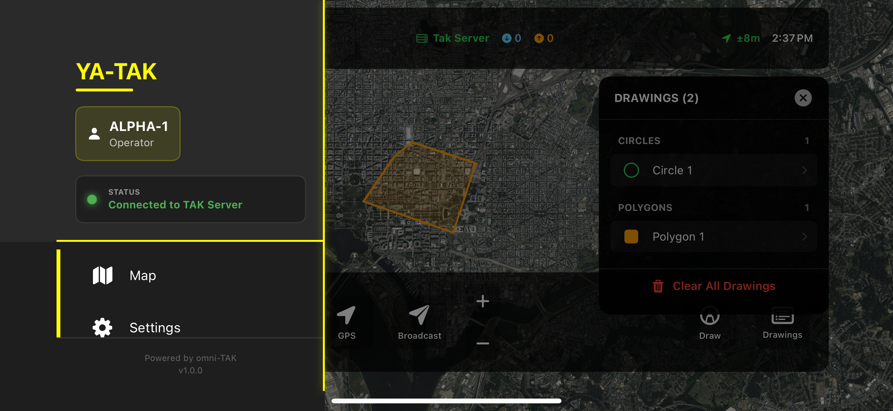
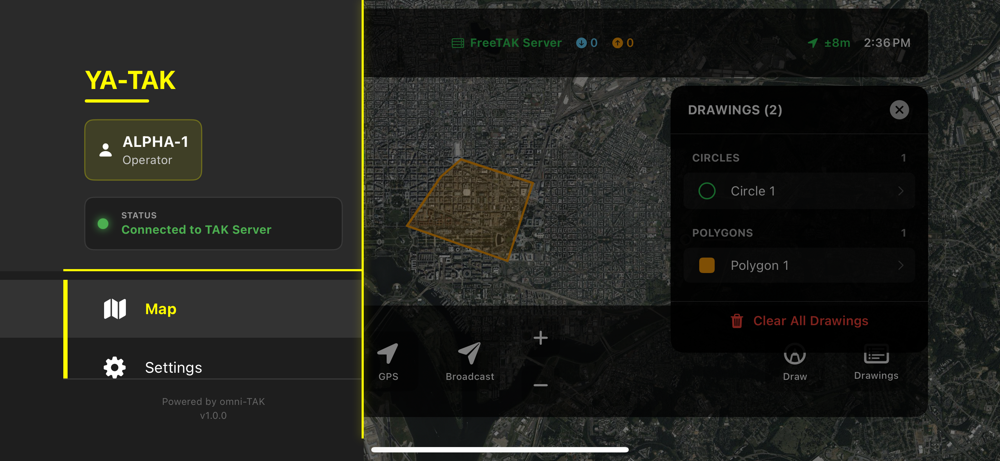
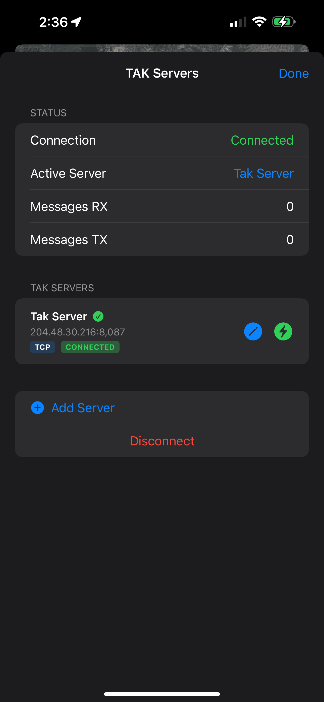

# OmniTAK Mobile

[](./LICENSE.md)
[]()
[]()
[](https://swift.org)
[](https://www.rust-lang.org/)

**OmniTAK Mobile is a cross-platform TAK (Team Awareness Kit) client built with Rust and native mobile frameworks.** It provides full ATAK-compatible tactical map functionality with multi-server management, real-time CoT (Cursor on Target) messaging, and a modern native UI.

## Latest Update

**OmniTAK Mobile is now available on the App Store for iOS.**

- Full ATAK-style UI with tactical theme
- Multi-server management with TLS support
- Certificate enrollment via QR code
- Drawing tools (circles, polygons, lines)
- Team chat and messaging
- Real-time map with satellite imagery
- Waypoint navigation and routing
- Portrait and landscape orientation support

## Features

### Tactical Map Interface
- **ATAK-style UI** - Professional tactical map interface mirroring ATAK's design
- **MapKit Integration** - Native iOS mapping with satellite, hybrid, and standard views
- **Real-time CoT Markers** - Live position updates with color-coded unit types (friendly/hostile/unknown)
- **GPS Tracking** - Real-time location with accuracy indicators
- **Interactive Controls** - Zoom, pan, layer switching, and GPS centering

### Multi-Server Management
- **Server Configuration** - Add, edit, and delete multiple TAK servers
- **Persistent Storage** - Server configurations saved locally with UserDefaults
- **One-Tap Switching** - Quickly switch between configured servers
- **Connection Status** - Real-time indicators showing active connections
- **Protocol Support** - TCP/UDP with optional TLS encryption
- **Active Server Display** - Current server name shown in status bar

### CoT Messaging
- **XML Parser** - Parse and display CoT messages from TAK servers
- **Broadcast Position** - Send self-position updates with full metadata
- **Event Tracking** - Monitor sent and received message counts
- **Type Filtering** - Filter units by affiliation (friendly, hostile, unknown)

### Drawing Tools
- **Circles** - Draw circular areas of interest on the map
- **Polygons** - Create multi-point polygon shapes
- **Drawing Management** - View, edit, and clear all drawings
- **Persistent Storage** - Drawings saved and restored across sessions
- **Color Coding** - Orange and green tactical colors for visibility

### User Interface
- **OmniTAK Branding** - Professional tactical theme with yellow accent (#FFFC00)
- **Navigation Drawer** - ATAK-style slide-in menu with user profile
- **Responsive Design** - Works in portrait and landscape orientations
- **Status Bar** - Real-time connection status, message counts, GPS accuracy, time
- **Bottom Toolbar** - Quick access to GPS, broadcast, zoom, layers, measure, and drawing tools
- **Layers Panel** - Toggle map types and unit overlays with visual feedback
- **Haptic Feedback** - Tactile response for all button interactions
- **Dark Mode Ready** - Semi-transparent overlays optimized for tactical use

### Plugin System
- **Secure Plugin Architecture** - Extensible plugin system with permission-based API access
- **Two Development Modes** - Local development (your own signing) or official distribution (OmniTAK signing)
- **GitLab CI/CD Integration** - Automated build, test, sign, and publish pipeline
- **Rich Plugin APIs** - Access to CoT messaging, map layers, networking, location, and UI
- **Code Signing** - All official plugins signed with OmniTAK's Apple Developer certificate
- **Plugin Registry** - GitLab Package Registry for distribution
- **Sandboxed Execution** - Plugins run in isolated contexts with defined API boundaries
- **Developer Tools** - Complete template, scripts, and documentation for plugin development

See [Plugin Development](#plugin-development) section below for details.

## Architecture

### Core Components

```
omniTAK-mobile/
├── apps/
│   ├── omnitak/                 # Native iOS app (OmniTAKMobile)
│   │   ├── OmniTAKMobile/
│   │   │   ├── OmniTAKMobileApp.swift    # App entry point
│   │   │   ├── MapViewController.swift   # Main ATAK interface
│   │   │   ├── TAKService.swift          # TAK server integration
│   │   │   ├── DrawingTools*.swift       # Tactical drawing system
│   │   │   ├── ChatManager.swift         # Team chat
│   │   │   ├── RadialMenu*.swift         # Context menus
│   │   │   └── Info.plist                # Permissions & config
│   │   ├── OmniTAKMobile.xcodeproj       # Xcode project
│   │   ├── screenshots/                  # App screenshots
│   │   └── README.md                     # Detailed build guide
│   └── omnitak_android/         # Valdi Android app
│       ├── BUILD.bazel                   # Bazel build configuration
│       ├── src/valdi/omnitak_app/        # TypeScript entry point
│       └── app_assets/android/           # Android resources
├── modules/
│   ├── omnitak_mobile/           # Cross-platform module
│   │   ├── src/                          # TypeScript/TSX application
│   │   ├── ios/                          # iOS native layer
│   │   └── android/                      # Android native layer
│   │       ├── native/                   # Kotlin + JNI + Rust
│   │       └── maplibre/                 # MapLibre integration
│   └── omnitak_plugin_system/    # Plugin system (NEW!)
│       └── ios/                          # iOS plugin infrastructure
│           ├── Sources/                  # Swift plugin APIs
│           └── BUILD.bazel               # Bazel build config
├── plugin-template/              # Plugin development template
│   ├── plugin.json                       # Plugin manifest
│   ├── ios/Sources/                      # Plugin implementation
│   ├── scripts/                          # Build and CI/CD scripts
│   └── .gitlab-ci.yml                    # Automated pipeline
├── docs/                         # Documentation
│   ├── PLUGIN_ARCHITECTURE.md            # Plugin system design
│   ├── PLUGIN_DEVELOPMENT_GUIDE.md       # Developer guide
│   ├── LOCAL_DEVELOPMENT_SETUP.md        # Local setup guide
│   └── PLUGIN_CI_CD_SETUP.md             # CI/CD configuration
└── scripts/                      # Build scripts
    ├── build_ios.sh                      # iOS build script
    └── run_ios_simulator.sh              # Simulator deployment
```

### Technology Stack

- **iOS Frontend**: SwiftUI + UIKit
- **Android Frontend**: Valdi framework (TypeScript + Kotlin)
- **Core Library**: Rust (cross-platform TAK protocol)
- **FFI**: C bindings (XCFramework for iOS, JNI for Android)
- **Mapping**: MapKit (iOS), MapLibre GL (Android)
- **Location**: CoreLocation (iOS), Android Location API
- **Build System**: Xcode (iOS), Bazel (Android)
- **Protocol**: TCP/UDP/TLS with TAK CoT XML

## Quick Start

**Want to run OmniTAK on your iPhone or simulator? Follow these simple steps.**

#### Option 1: iOS Simulator (Easiest - No iPhone Needed)

```bash
# 1. Clone the repository
git clone https://github.com/engindearing-projects/omniTAK-mobile.git
cd omniTAK-mobile/apps/omnitak

# 2. Open in Xcode
open OmniTAKMobile.xcodeproj

# 3. Select any iPhone simulator from the device dropdown
# 4. Press ⌘+R (or click the Play button)
# Done. App launches in ~2-5 minutes on first build
```

**That's it!** No code signing, no Apple ID required for simulator.

#### Option 2: Physical iPhone/iPad

```bash
# 1. Clone the repository
git clone https://github.com/engindearing-projects/omniTAK-mobile.git
cd omniTAK-mobile/apps/omnitak

# 2. Open in Xcode
open OmniTAKMobile.xcodeproj

# 3. Configure signing (one-time):
#    - Select OmniTAKMobile target → Signing & Capabilities
#    - Check "Automatically manage signing"
#    - Select your Apple ID as Team
#    - Change Bundle ID to: com.yourname.omnitak (must be unique)

# 4. Connect iPhone via USB and select it in device dropdown
# 5. Press ⌘+R to build and install
# 6. On iPhone: Settings → General → VPN & Device Management
#    → Trust your Apple ID → Trust
# Done.```

#### Detailed Instructions

For complete step-by-step instructions with screenshots and troubleshooting:

**[ See apps/omnitak/README.md](apps/omnitak/README.md)**

The detailed README includes:
-  Absolute beginner's guide (never built iOS app before? Start here!)
-  Prerequisites with validation commands
-  Visual success/failure indicators
-  20+ troubleshooting scenarios with solutions
-  Screenshots of the app
-  Expected output at every step

### Setting Up TAK Server (Optional)

OmniTAK works offline for testing, but to connect to real TAK servers:

```bash
# Install Taky (local TAK server)
pip install taky

# Start Taky server
taky -l debug
# Server runs on 127.0.0.1:8087
```

Configure in app: **Menu (≡)** → **Servers** → **Add Server**

### System Requirements

**iOS:**
- macOS 12.0+ (Monterey or later)
- Xcode 15.0+ ([Free from App Store](https://apps.apple.com/us/app/xcode/id497799835))
- iOS 15.0+ device or simulator
- Apple ID (free account works)

**Android:**
- Bazel 7.2.1+
- Android SDK API 34+
- Android NDK r21+
- Node.js 18+

### Android Installation

1. **Clone the repository:**
   ```bash
   git clone https://github.com/engindearing-projects/omniTAK-mobile.git
   cd omniTAK-mobile
   ```

2. **Install Rust Android targets:**
   ```bash
   rustup target add aarch64-linux-android
   rustup target add armv7-linux-androideabi
   rustup target add x86_64-linux-android
   rustup target add i686-linux-android
   ```

3. **Build Rust libraries for Android:**
   ```bash
   # Set path to omni-TAK repository
   export OMNI_TAK_DIR=~/omni-TAK

   cd modules/omnitak_mobile
   ./build_android.sh
   ```

4. **Build Android APK:**
   ```bash
   cd ../..
   bazel build //apps/omnitak_android
   ```

5. **Install on device:**
   ```bash
   adb install -r bazel-bin/apps/omnitak_android/omnitak_android.apk
   ```

For detailed Android build instructions, see [apps/omnitak_android/README.md](apps/omnitak_android/README.md).

## Plugin Development

**NEW!** OmniTAK now supports a secure plugin system for extending functionality.

### Two Development Modes

#### Local Development (Your Own Signing)
- Use your own Apple Developer account (free or paid)
- Build and test on your own iPhone/iPad
- Perfect for learning and experimentation
- No approval needed

#### Official Distribution (OmniTAK Signing)
- Submit plugins for official distribution
- Signed with OmniTAK's certificate via GitLab CI/CD
- Published to official plugin registry
- Available to all OmniTAK users
- Requires code review

### Getting Started with Plugins

```bash
# Navigate to plugin template
cd plugin-template

# Configure local signing (first time)
cp .bazelrc.local.example .bazelrc.local
# Edit .bazelrc.local with your Apple Developer Team ID

# Build for simulator (no signing needed)
./scripts/build_plugin_ios.sh simulator debug

# Build for your iPhone
./scripts/build_plugin_ios.sh device debug
```

### Plugin Documentation

Complete guides available in the `docs/` directory:

- **[Plugin Architecture](docs/PLUGIN_ARCHITECTURE.md)** - System design, security model, API reference
- **[Plugin Development Guide](docs/PLUGIN_DEVELOPMENT_GUIDE.md)** - Complete developer guide with examples
- **[Local Development Setup](docs/LOCAL_DEVELOPMENT_SETUP.md)** - Set up your Mac for plugin development
- **[CI/CD Setup](docs/PLUGIN_CI_CD_SETUP.md)** - GitLab CI/CD configuration for automated signing

### Plugin Features

- **CoT Message Handling** - Process and filter Cursor-on-Target messages
- **Map Layers** - Add custom map overlays and markers
- **UI Components** - Create panels, toolbars, and dialogs
- **Network Access** - Make HTTP/HTTPS requests
- **Location Services** - Access device GPS
- **Persistent Storage** - Save plugin data
- **Permission System** - Fine-grained access control

### Quick Plugin Example

```swift
import OmniTAKPluginSystem

@objc public class MyPlugin: NSObject, OmniTAKPlugin {
    func initialize(context: PluginContext) throws {
        context.logger.info("Plugin initialized")
    }

    func activate() throws {
        // Register CoT handler
        let cotManager = try context.cotManager
        try cotManager?.registerHandler(self)
    }
}
```

See the [plugin-template](plugin-template/) directory for a complete working example.

### Using the App

1. **Start Taky Server** - Run `taky -l debug` to start local TAK server on port 8087
2. **Launch App** - App auto-connects to default Taky Server
3. **View Map** - Satellite imagery with tactical overlays
4. **Manage Servers** - Tap status bar to access server list
5. **Add Server** - Tap "+" to configure new TAK server
6. **Switch Servers** - Tap bolt icon to connect to different server
7. **Broadcast Position** - Tap "Broadcast" to send CoT update
8. **Toggle Layers** - Tap "Layers" to change map type and unit filters

## Configuration

### Default TAK Server (Taky)

The app ships with a default local Taky Server configuration:

```swift
TAKServer(
    name: "Taky Server",
    host: "127.0.0.1",
    port: 8087,
    protocolType: "tcp",
    useTLS: false
)
```

**Starting Taky Server:**
```bash
# Install Taky (if not already installed)
pip install taky

# Start Taky server in debug mode
taky -l debug
```

The server will start on `127.0.0.1:8087` and the app will automatically connect on launch.

### Adding Custom Servers

1. Open server list (tap status bar)
2. Tap "Add Server" (+)
3. Enter server details:
   - Name (e.g., "My TAK Server")
   - Host (IP address or hostname)
   - Port (default: 8087)
   - Protocol (TCP or UDP)
   - TLS (toggle if using SSL/TLS)
4. Tap "Save Server"

## Screenshots

###  Live iPhone Deployment (Nov 9, 2025)

#### Tactical Map with Drawing Tools (Landscape)
<p align="center">
  
</p>

*Full tactical view showing drawn circle and polygon on satellite imagery with drawings panel*

#### Navigation Drawer & Drawing Tools (Portrait)
<p align="center">
  
  
</p>

*Left: OmniTAK navigation drawer with ALPHA-1 user profile | Right: Drawing tools with active shapes*

#### Server Management (Portrait)
<p align="center">
  
</p>

*Multi-server configuration showing active connection to TAK Server via TCP*

## Development

### Project Structure

- **MapViewController.swift** (800+ lines)
  - ATAKMapView: Main map with UIViewRepresentable wrapper
  - ATAKStatusBar: Connection status and metrics
  - ATAKBottomToolbar: Quick action buttons
  - ATAKSidePanel: Layers and overlays
  - ServerConfigView: Multi-server management
  - ServerEditView: Add/edit server dialog

- **TAKService.swift**
  - Rust FFI integration
  - CoT XML parsing
  - Server connection management
  - Event callbacks

- **ServerManager.swift**
  - Server CRUD operations
  - Persistent storage
  - Active server tracking

### Building from Source

```bash
# Build iOS app with Xcode CLI
cd apps/omnitak
xcodebuild -scheme OmniTAKMobile \
           -configuration Debug \
           -sdk iphonesimulator \
           -destination 'platform=iOS Simulator,name=iPhone 16 Pro' \
           build

# Or simply open in Xcode
open OmniTAKMobile.xcodeproj
# Then press ⌘+R to build and run
```

### Running on Simulator

```bash
# Method 1: Use Xcode (Recommended)
# Just press ⌘+R in Xcode

# Method 2: Command line
cd apps/omnitak
xcodebuild -scheme OmniTAKMobile \
           -configuration Debug \
           -sdk iphonesimulator \
           -destination 'platform=iOS Simulator,name=iPhone 16 Pro' \
           build run
```

### Troubleshooting

**Build errors?** See the comprehensive troubleshooting guide:
- [apps/omnitak/README.md#troubleshooting](apps/omnitak/README.md#troubleshooting)

**Common fixes:**
```bash
# Clean build folder
# In Xcode: Product → Clean Build Folder (Shift + ⌘ + K)

# Or via command line:
cd apps/omnitak
xcodebuild clean -scheme OmniTAKMobile
```

## Roadmap

### Completed 
- [x] iOS physical device deployment
- [x] Drawing tools (circles, polygons)
- [x] Multi-server management
- [x] Real-time TAK server connectivity
- [x] ATAK-style navigation drawer
- [x] User profile system
- [x] Secure plugin system with GitLab CI/CD
- [x] Plugin development template and tools
- [x] Comprehensive plugin documentation

### In Progress 
- [ ] Plugin registry and marketplace
- [ ] Example plugins (weather, tools, overlays)
- [ ] Android implementation
- [ ] Advanced CoT filtering and search
- [ ] Offline map caching
- [ ] Team chat integration
- [ ] File sharing and attachments
- [ ] Mission planning tools
- [ ] Integration with external sensors
- [ ] Data replay and simulation

## Contributing

We welcome contributions. Please follow these guidelines:

1. Fork the repository
2. Create a feature branch (`git checkout -b feature/amazing-feature`)
3. Commit your changes (`git commit -m 'Add amazing feature'`)
4. Push to the branch (`git push origin feature/amazing-feature`)
5. Open a Pull Request

## License

This project is licensed under the MIT License - see the [LICENSE.md](LICENSE.md) file for details.

## Acknowledgments

- Built with Rust for cross-platform core functionality
- Uses MapKit for native iOS mapping
- Compatible with TAK CoT XML protocol
- Inspired by ATAK's tactical UI/UX design

## Support

For questions, issues, or feature requests:
- Open an issue on GitHub
- Contact: [Engineering Projects](https://github.com/engindearing-projects)

---

**Note**: This is an alpha release. Features are under active development and APIs may change.
